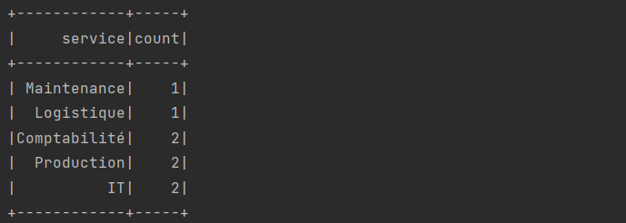
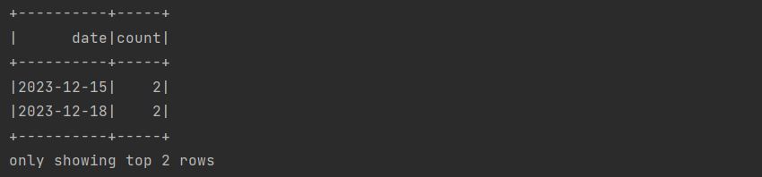

# TP5: Spark SQL

## Exercice 1 :
L'objectif de cet exercice est de traiter les données d'incidents de chaque service d'une entreprise industrielle. Les incidents sont stockés dans un fichier csv :
```
Id,titre,description,service,date
1,"Problème d'imprimante","L'imprimante du service comptabilité ne fonctionne pas",Comptabilité,2023-12-15
2,"Erreur de connexion","Les utilisateurs ne peuvent pas se connecter au réseau",IT,2023-12-17
3,"Panne de machine","La machine de production 3 est hors service",Production,2023-12-18
4,"Problème de logiciel","Le logiciel de gestion des stocks plante fréquemment",Logistique,2023-12-20
5,"Besoin de maintenance","Le système de climatisation doit être réparé",Maintenance,2023-12-21
6,"Problème d'imprimante","L'imprimante du service comptabilité ne fonctionne pas",Comptabilité,2023-12-15
7,"Erreur de connexion","Les utilisateurs ne peuvent pas se connecter au réseau",IT,2023-12-17
8,"Panne de machine","La machine de production 3 est hors service",Production,2023-12-18
```

### 1. Afficher le nombre d’incidents par service.
```java
public class Task1 {
    public static void main(String[] args) {
        // L'application Spark qui affiche le nombre d’incidents par service.
        SparkSession spark = SparkSession
                .builder()
                .appName("Task1")
                .master("local[*]")
                .getOrCreate();

        // L'écriture du fichier CSV en tant que DataFrame
        Dataset<Row> data = spark.read()
                .option("header", "true")
                .option("inferSchema", "true")
                .csv("src/main/resources/Incidents.csv");

        // Affichage du nombre d'incidents par service
        data.groupBy("service").count().show();

        // Fermeture de la session Spark
        spark.stop();
    }
}
```

#### Résultat ✅


### 2. Afficher les deux années où il a y avait plus d’incidents.
```java
public class Task2 {
    public static void main(String[] args) {
        // L'application Spark qui affiche le nombre d’incidents par service.
        SparkSession spark = SparkSession
                .builder()
                .appName("Task1")
                .master("local[*]")
                .getOrCreate();

        // L'écriture du fichier CSV en tant que DataFrame
        Dataset<Row> data = spark.read()
                .option("header", "true")
                .option("inferSchema", "true")
                .csv("src/main/resources/Incidents.csv");

        // Affichage de deux années où le nombre d'incidents est le plus élevé
        data.groupBy("date").count().orderBy(col("count").desc()).show(2);
    }
}
```

#### Résultat ✅
