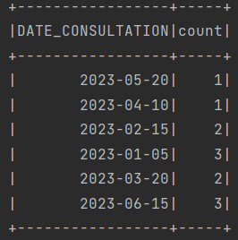
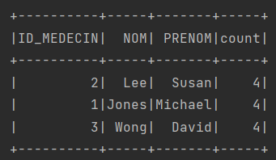

# TP5: Spark SQL ✨

## Exercice 1 :
L'objectif de cet exercice est de traiter les données d'incidents de chaque service d'une entreprise industrielle. Les incidents sont stockés dans un fichier csv :
```
Id,titre,description,service,date
1,"Problème d'imprimante","L'imprimante du service comptabilité ne fonctionne pas",Comptabilité,2023-12-15
2,"Erreur de connexion","Les utilisateurs ne peuvent pas se connecter au réseau",IT,2023-12-17
3,"Panne de machine","La machine de production 3 est hors service",Production,2023-12-18
4,"Problème de logiciel","Le logiciel de gestion des stocks plante fréquemment",Logistique,2023-12-20
5,"Besoin de maintenance","Le système de climatisation doit être réparé",Maintenance,2023-12-21
6,"Problème d'imprimante","L'imprimante du service comptabilité ne fonctionne pas",Comptabilité,2023-12-15
7,"Erreur de connexion","Les utilisateurs ne peuvent pas se connecter au réseau",IT,2023-12-17
8,"Panne de machine","La machine de production 3 est hors service",Production,2023-12-18
```

### 1. Afficher le nombre d’incidents par service.
```java
public class Task1 {
    public static void main(String[] args) {
        // L'application Spark qui affiche le nombre d’incidents par service.
        SparkSession spark = SparkSession
                .builder()
                .appName("Task1")
                .master("local[*]")
                .getOrCreate();

        // L'écriture du fichier CSV en tant que DataFrame
        Dataset<Row> data = spark.read()
                .option("header", "true")
                .option("inferSchema", "true")
                .csv("src/main/resources/Incidents.csv");

        // Affichage du nombre d'incidents par service
        data.groupBy("service").count().show();

        // Fermeture de la session Spark
        spark.stop();
    }
}
```

#### Résultat ✅


### 2. Afficher les deux années où il a y avait plus d’incidents.
```java
public class Task2 {
    public static void main(String[] args) {
        // L'application Spark qui affiche le nombre d’incidents par service.
        SparkSession spark = SparkSession
                .builder()
                .appName("Task1")
                .master("local[*]")
                .getOrCreate();

        // L'écriture du fichier CSV en tant que DataFrame
        Dataset<Row> data = spark.read()
                .option("header", "true")
                .option("inferSchema", "true")
                .csv("src/main/resources/Incidents.csv");

        // Affichage de deux années où le nombre d'incidents est le plus élevé
        data.groupBy("date").count().orderBy(col("count").desc()).show(2);
    }
}
```

#### Résultat ✅


## Exercice 2 : Traitement de données stockées dans Mysql
L'objectif de cet exercice est de traiter les données stockées dans une base de données relationnelle Mysql nommée DB_HOPITAL, qui contient trois tables PATIENTS, MEDECINS et CONSULTATIONS.

### Les tables
#### La table Consultation


#### La table Medecins


#### La table Patients


### 1. Afficher le nombre de consultations par jour.
```java
// L'application Spark qui affiche le nombre de consultations par jour
public class Task1 {
    public static void main(String[] args) {
        SparkSession spark = SparkSession
                .builder()
                .appName("Task1")
                .master("local[*]")
                .getOrCreate();

        // L'écriture des données dans un SGBD relationnel
        Dataset<Row> consultations = spark
                .read()
                .format("jdbc")
                .option("driver", "com.mysql.jdbc.Driver")
                .option("url", "jdbc:mysql://localhost:3306/DB_HOPITAL")
                .option("dbtable", "CONSULTATIONS")
                .option("user", "root")
                .option("password", "")
                .load();

        // Affichage du nombre de consultations par jour
        consultations.groupBy("DATE_CONSULTATION").count().show();
    }
}
```

#### Résultat ✅


### 2. Afficher le nombre de consultation par médecin.
```java
public class Task2 {
    public static void main(String[] args) {
        SparkSession spark = SparkSession
                .builder()
                .appName("Task1")
                .master("local[*]")
                .getOrCreate();

        // L'écriture des données dans un SGBD relationnel utilisant une jointure entre Medecins et Consultations
        Dataset<Row> consultations = spark
                .read()
                .format("jdbc")
                .option("driver", "com.mysql.jdbc.Driver")
                .option("url", "jdbc:mysql://localhost:3306/DB_HOPITAL")
                .option("query", "SELECT MEDECINS.ID, NOM, PRENOM FROM CONSULTATIONS INNER JOIN MEDECINS ON CONSULTATIONS.ID_MEDECIN = MEDECINS.ID")
                .option("user", "root")
                .option("password", "")
                .load();

        // Affichage du nombre de consultations par medicine
        consultations.groupBy("ID").count().show();
    }
}
```

#### Résultat ✅


### 3. Afficher pour chaque médecin, le nombre de patients qu’il a assisté.
```java
public class Task3 {
    public static void main(String[] args) {
        SparkSession spark = SparkSession
                .builder()
                .appName("Task1")
                .master("local[*]")
                .getOrCreate();

        // L'écriture des données dans la table Medecins
        Dataset<Row> medecins = spark
                .read()
                .format("jdbc")
                .option("driver", "com.mysql.jdbc.Driver")
                .option("url", "jdbc:mysql://localhost:3306/DB_HOPITAL")
                .option("dbtable", "MEDECINS")
                .option("user", "root")
                .option("password", "")
                .load();

        // L'écriture des données dans la table Consultations
        Dataset<Row> consultations = spark
                .read()
                .format("jdbc")
                .option("driver", "com.mysql.jdbc.Driver")
                .option("url", "jdbc:mysql://localhost:3306/DB_HOPITAL")
                .option("dbtable", "CONSULTATIONS")
                .option("user", "root")
                .option("password", "")
                .load();

        // L'écriture des données dans la table Patients
        Dataset<Row> patients = spark
                .read()
                .format("jdbc")
                .option("driver", "com.mysql.jdbc.Driver")
                .option("url", "jdbc:mysql://localhost:3306/DB_HOPITAL")
                .option("dbtable", "PATIENTS")
                .option("user", "root")
                .option("password", "")
                .load();

        // Grouper les consultations par médecin et par patient pour compter le nombre de patients assistés par médecin
        Dataset<Row> countPerDoctor = consultations.groupBy("ID_MEDECIN", "ID_PATIENT")
                .agg(countDistinct("ID_PATIENT").alias("NUM_PATIENTS_ASSISTED"));

        // Jointure entre countPerDoctor et medecins pour afficher le nom et le prénom du médecin
        Dataset<Row> joinedDF = countPerDoctor.join(medecins, countPerDoctor.col("ID_MEDECIN")
                        .equalTo(medecins.col("ID")))
                .groupBy("NOM", "PRENOM")
                .agg(sum("NUM_PATIENTS_ASSISTED").alias("TOTAL_PATIENTS_ASSISTED"))
                .select("NOM", "PRENOM", "TOTAL_PATIENTS_ASSISTED");

        // Affichage du nombre de patients assistés par médecin
        joinedDF.show();

        // Fermeture de la session Spark
        spark.stop();
    }
}
```

#### Résultat ✅
